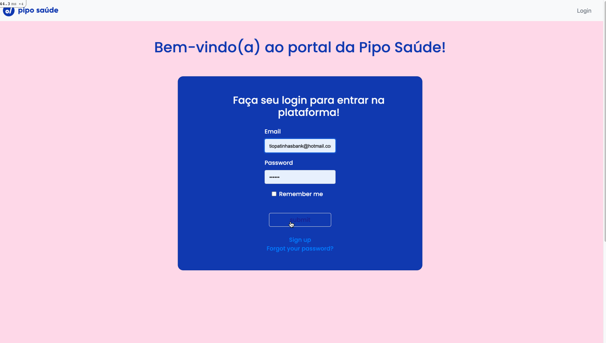

## *PipoSaúde Challenge*
Desafio técnico para empresa PipoSaúde <br />

### *Tabela de conteúdo*
* [Sobre](#Sobre)
* [Descrição](#Descrição)
* [Features](#Features)
* [Pré-Requisitos](#Pré-Requisitos)
* [IniciandoApp](#IniciandoApp)
* [Testes](#Testes)
* [Arquitetura](#Arquitetura)
* [Projeto Futuro](#Projeto-Futuro)

### *Sobre*
O objetivo principal do exercício é avaliar como atacar o problema;<br />
Verificar a organização do raciocínio e o código;<br />
Conhecimentos de desenvolvimento de Software;<br />
Comunicação e colaboração para criação do app;<br />

### *Descrição*
A aplicação consiste em ajudar funcionários do RH de uma empresa adicionar novos membros na mesma, incluindo todos eles nos benefícios que a empresa oferece.<br />
Foi levado em consideração que cada benefício requer dados cadastrais distintos.<br />

Para solução foi criado três Tables, sendo elas:<br />
- Funcionários<br />
- Planos<br />
- Users ( que neste caso, um usuário seria uma empresa, cliente da PipoSaúde)<br />

<div align = "center" >
  
</div><br />

Ao acessar o app, o login é feito com email e senha da empresa que contratou nosso serviço;<br />
Ao entrar na plataforma, o usuário poderá seguir por dois caminhos:<br />

1- Visitar a página funcionários onde é possível ver todos os funcionários presentes na empresa com seus dados básicos (nome, CPF, benefícios), editar os dados de um funcionário, realizar o desligamento e também adicionar um novo membro.<br />
Ao adicionar um novo membro, todos os dados necessários deverão ser preenchidos, levando em consideração os benefícios que aquela empresa possui e dados que ela pede.<br />

2- Visitar todos os benefícios oferecidos pela empresa, e mais detalhadamente, ao clicar em cada um é possível ver todos os funcionários ativos nele e seus dados de acordo com o que cada benefício pede na ficha cadastral.<br />

### *Features*
Abaixo, segue um curto vídeo de demonstração do app.<br />

<h1 align = "center" >
  
</h1>

### *Pré-Requisitos*
Antes de iniciar, é necessário ter instalado na máquina as seguintes ferramentas: [Git](https://git-scm.com), [Ruby 3.0.3](https://www.ruby-lang.org/pt/downloads/), para o banco de dados foi utilizado o [SQLite3](https://www.sqlite.org/about.html). Além disso, é aconselhavel ter um editor para trabalhar com o código, como o [VSCode](https://code.visualstudio.com/).

### *IniciandoApp*
```bash
#Clone este repositório
$ git clone <https://github.com/alyssagc/PipoChallenge.git>

#Acesse a pasta do projeto no terminal/cmd
$ cd PipoChallenge

#Instale as dependências
$ yarn install
$ bundle install

#Rode o seed
$ rails db:reset

#Iniciar o servidor
$ rails s

#Acesse o app no <http://localhost:3000/>
```
### *OBS*

Possíveis usuários para testar o app:<br />

Acme Co. - Usuário: acme@hotmail.com<br />
           Senha: 123456<br />

Tio Patinhas Bank - Usuário: tiopatinhasbank@hotmail.com<br />
           Senha: 123456<br />

### *Testes*

Para os testes foi utilizado o framework Rspec, junto com a library Capybara. Para instalar basta seguir os seguintes comandos no terminal:

```
#Adicionar o RSpec ao seu projeto (Será necessário executar apenas se não foi dado
um 'bundle install' anteriormente
$ bundle install

#Instalando o RSpec
$ rails generate rspec:install

#Checar os Testes
$ rails rspec
```

### *Arquitetura*

Ao acessar o VSCode, você vai encontrar um projeto seguindo a estrutura MVC (Model View Controller), com intuito de deixar o código mais organizado e legível.<br />

No app/models temos os três modelos utilizados no projeto (User, Funcionario e Plano) com suas respectivas associações e validações.<br />

No app/controllers, você encontra três controllers, sendo eles Funcionários, Home e Planos, necessários para intermediar as requisições enviadas pela View com as respostas fornecidas pelo Model.<br />

No app/views você encontra todas as views organizadas em pastas, que o usuário tem ao accessar o aplicativo, é a partir das interações do usuário que o controller pega essas informações e passa para o respectivo Model, este avalia a informação e transmite uma resposta.<br />

Além desses, você pode acessar config/routes para verificar as possíveis rotas de acesso no servidor e spec/features onde se encontra todos os testes criados.

Abaixo uma imagem representativa do MVC:<br />
<div align = "center" >

</div><br />

### *Projeto Futuro*

Ao acessar a página de benefícios, existe um botão 'adicionar um novo benefício' que não foi implementado a tempo da entrega. A ideia é desenvolver toda essa parte da relação Plano X Empresa, para que futuramente as empresas possam adicionar ou remover parceiros, assim podendo oferecer seus funcionários os planos com as melhores ofertas.<br />

---
